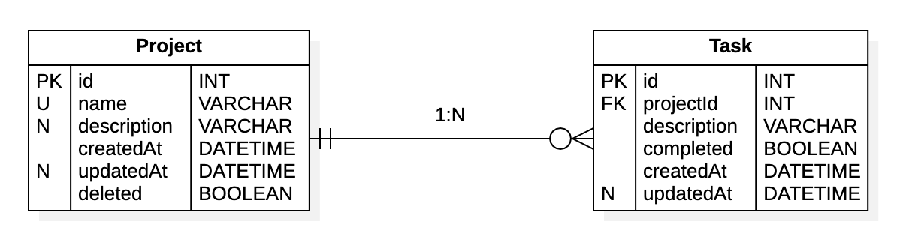

# NodeJs-Prisma ORM SQLite

## Crear migración modelado Prisma ORM a SQLite

```bash
npx prisma migrate dev --name init --schema ./src/prisma/schema.prisma
```

## Generar esquema

```bash
npx prisma generate --schema ./src/prisma/schema.prisma
```

## Iniciar proyecto

```bash
npm run dev
```

## Modelo Entidad relación



## Script SQL

```sql

CREATE TABLE Project (
    id          INTEGER         NOT NULL AUTOINCREMENT,
    name        TEXT            NOT NULL,
    description TEXT                NULL,
    createdAt   DATETIME        NOT NULL DEFAULT CURRENT_TIMESTAMP,
    updatedAt   DATETIME            NULL,
    deleted     BOOLEAN         NOT NULL DEFAULT false,
    CONSTRAINT  pkProject        PRIMARY KEY (id),
    CONSTRAINT  ukNameProject    UNIQUE(name)
);

CREATE TABLE Task (
    id          INTEGER     NOT NULL AUTOINCREMENT,
    description TEXT        NOT NULL,
    completed   BOOLEAN     NOT NULL DEFAULT false,
    createdAt   DATETIME    NOT NULL DEFAULT CURRENT_TIMESTAMP,
    updatedAt   DATETIME        NULL,
    projectId   INTEGER     NOT NULL,
    CONSTRAINT  pkTask      PRIMARY KEY (id),
    CONSTRAINT  fkTaskProjectIdProject
        FOREIGN KEY (projectId)
        REFERENCES Project (id) ON DELETE RESTRICT ON UPDATE CASCADE
);

```

## Dependencias de desarrollo

```bash
npm install --save-dev nodemon
npm install --save-dev prisma
```

## Dependencias

```bash
npm install --save @prisma/client
npm install --save cors
npm install --save express
npm install --save express-group-routes
npm install --save express-validator
```
